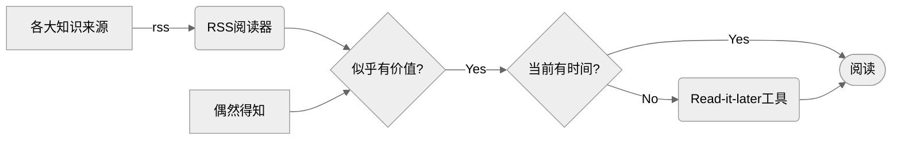
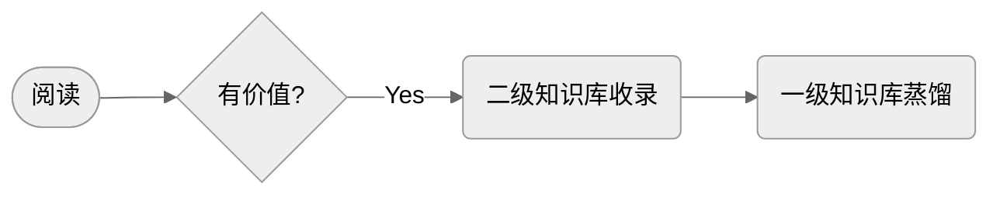

在信息爆炸的今天，高效的获取高质量数据能够节省大量时间，同时合理的知识处理能够更好的为个人的工作、学习等打下基础。

## 知识获取

首先是知识来源的选择，取决于各自的目标，包括但不限于：
1. 微信公众号
2. InfoQ 的各类 topic：[https://www.infoq.cn/topic/](https://www.infoq.cn/topic/)
3. 博客
4. 各论文期刊
5. 其它

不知道有哪些时，多和身边的人沟通即可。

同时，可以看到信息的来源多种多样，得益于 RSS，我们能够让信息主动来找我们，避免了反复在各种软件、设备中横跳获取信息。然而国内网站对 RSS 支持十分糟糕，因此需要借助第三方软件/平台等让原本不支持 RSS 订阅的网站、公众号上发布的信息能够以 RSS 的形式获取到。

1. RSSHub：社区共同维护的工具，用来从原本不支持 RSS 的网站生成 RSS
2. [werss](https://werss.app/)：专注于微信公众号的 RSS 生成

RSS 阅读器则多种多样，任一款自己喜欢的即可。
* Newsblur
* FreshRss
* [Github rss-reader](https://github.com/topics/rss-reader)

## 知识处理

* 一级注重知识点与知识点的关系及自己的思考总结，用于泛型知识，及发散思考，注重全局观
* 二级注重细节知识的积累，用于解决具体问题
* 检索时统一检索
